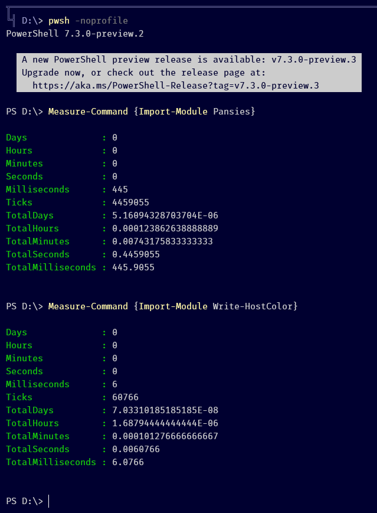

# `Write-HostColor`

`Write-Host`, but with full RGB colors. Requires PowerShell Core 7.2+.

## Installation

Clone this repository to a directory that's in your `$env:PSModulePath`.

## How to use

The API is the same as the `Write-Host` cmdlet, but both `-ForegroundColor` and `-BackgroundColor` parameters support extra color formats:

- Console colors (same as supported by `Write-Host`, autocompleted)
	e.g. `Write-HostColor "hello" -ForegroundColor Red`
- CSS color as a hexadecimal string: `#xxxxxx` or `#xxx`
	e.g. `Write-HostColor "hello" -ForegroundColor "#f00" -BackgroundColor "#34abf0"`
- Array with 3 integer values, which is interpreted as a RGB tuple
	e.g. `Write-HostColor "hello" -ForegroundColor 255, 0, 0`
- VT escape sequences
	e.g. `Write-HostColor "hello" -ForegroundColor $PSStyle.Foreground.Red`

Additionally, the `Get-ColorEscapeSequence` function lets you retrieve the raw VT escape sequence in case you're building an output string manually. Example:

```powershell
(Get-ColorEscapeSequence Foreground "#ff00dd") + "test" + $PSStyle.Reset
```


## Why wouldn't I just use [Pansies](https://github.com/PoshCode/Pansies/) instead?



If you want to use RGB colors in your PowerShell banner or custom prompt, that's a 400ms difference in load time every time you open PowerShell.